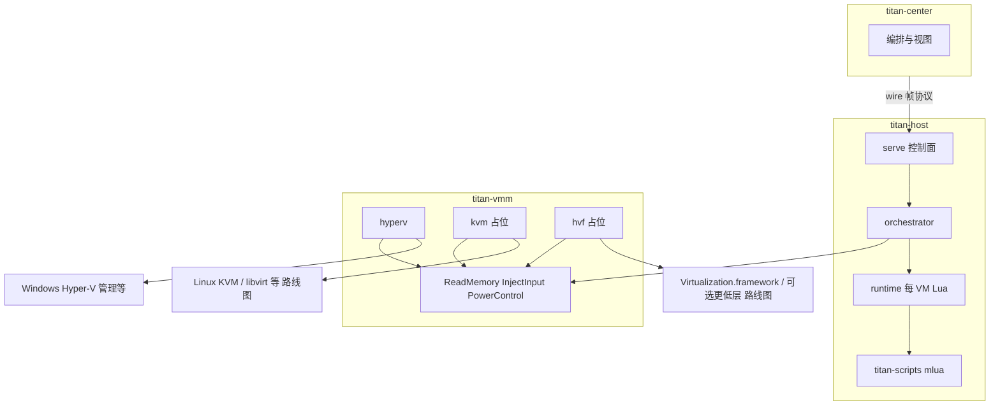

# titan-host 跨平台架构（路线图）

## 范围与权威来源

本文描述 **titan-host 多宿主 OS / 多虚拟化后端** 的目标分层、典型 API 与 Rust 生态**调研参考**，以及演进顺序；**不**改变 Phase 1 验收范围。

- **Phase 1 DoD、主题 → crate 对照**：以 [`crates/titan-common/src/need_mapping.rs`](../crates/titan-common/src/need_mapping.rs) 为准。
- **元能力 → 实现轨 → 测试**：以 [requirements-traceability.md](requirements-traceability.md) 追溯表为准。
- **合法用途与免责声明**：见 [`need.md`](../need.md) 文首段落；本文不重复展开政策论述。

---

## 分层架构

中控、宿主服务、VMM 抽象与 OS API 的关系如下（Lua 仅通过宿主 Rust 层调用能力，不直连内核或 hypervisor）。

要点：

- **`titan-host`**：TCP 控制面、provision/电源编排、每 VM **有界** Lua（`titan-host::runtime`）；依赖 **`titan-vmm`** 与能力探测，而非在二进制内写死单一 OS。
- **`titan-scripts`**：`mlua`（`lua54`、vendored），脚本语义由宿主暴露的 API 与 **`Capabilities`** 共同约束。
- **`titan-vmm`**：跨后端共享 [`traits.rs`](../crates/titan-vmm/src/traits.rs) 中的 `ReadMemory`、`InjectInput`、`PowerControl`；[`hyperv`](../crates/titan-vmm/src/hyperv/mod.rs) 为当前主实作，[`kvm`](../crates/titan-vmm/src/kvm/mod.rs)、[`hvf`](../crates/titan-vmm/src/hvf/mod.rs) 为占位实现（返回 `NotImplemented` 等）。

---

## 宿主 OS × 后端矩阵（扩写）

在 [`need.md`](../need.md) 的精简表之上，下表补充**管理面形态**、**可选底层 API**、**Rust 生态调研参考**（**非**依赖锁定）与**权限/分发**注意。仓库当前 **Phase 1** 仍以 Windows + Hyper-V 管理轨为 DoD。

| 宿主 OS | 产品化后端（管理 / 生命周期） | 可选或后续的裸 API 层 | Rust 生态参考（调研） | 权限 / 分发要点 |
|---------|--------------------------------|------------------------|------------------------|-----------------|
| Windows | **Hyper-V**：VM 创建、差分盘、电源、GPU-PV 等（`titan-vmm::hyperv`） | **WHP**：WinHvPlatform 用户态 hypervisor 接口；与「通过 Hyper-V 管理 VM」**不同层** | 宿主管理：`windows` / WMI / PowerShell 调用链；WHP：`whp` 等封装（若引入需单独评估） | 驱动与可选 WHV 路径涉及签名、SKU（Pro/企业等）；**同一 VM 应避免被 Hyper-V 管理与 WHP 栈同时「拥有」**（双头管理） |
| Linux | **KVM + QEMU/libvirt**（路线图）：镜像、快照、网络由管理栈统一 | `KVM_CREATE_VM` 等 ioctl；或自研小 VMM（工作量大） | `kvm-ioctls`、`kvm-bindings`；管理面常见 **libvirt / QMP** | `/dev/kvm` 权限、cgroup、与发行版自带 libvirt 策略共存 |
| macOS | **Virtualization.framework**（`hvf` 模块占位中的首选生命周期路径） | **Hypervisor.framework** 与 QEMU **`hvf`**：更低层 VM-exit 类控制（若产品需要再评估） | Apple 平台 crate / 绑定随选型而变；与 **entitlement**（如 `com.apple.security.hypervisor`）配套 | 除签名外须配置 **Hypervisor entitlement**；Apple Silicon 与 Intel 行为差异需单独矩阵 |

**WHP 与 Hyper-V 管理轨**：当前仓库以 **Hyper-V 作为 VM 真源**（创建、存储、电源）。若未来引入 WHP 做 guest 物理内存读写或 exit 处理，须在架构上明确 **单一 owner**（谁创建、谁运行、谁销毁 VM），避免两套 API 同时驱动同一实例。

---

## 元能力与平台差异

[`need.md`](../need.md) 中五大元能力（内存、伪装、输入、视觉、网络）对 Windows 轨已写主要底层落点。跨平台原则：

1. **协作式 Guest Agent**（TCP/JSON 等）在 Linux/macOS 上往往是 **最先闭环** 的路径，与 Phase 1 Windows 协作模型一致。
2. **Hypervisor 直连**（guest 物理内存、总线级输入、CPUID/MSR 级策略）按后端分阶段实现；**未实现**时须通过错误与 **`Capabilities`** 位诚实反映，避免中控或 Lua 假定能力存在。
3. **内存语义**：区分 **guest 物理地址**（hypervisor/WinHv 等视角）与 **经 agent 的虚拟地址 / 载荷语义**。`ReadMemory` 的文档注释已说明：在 Windows / Hyper-V 下，ring-3 **未必**能无协作地读任意 guest RAM；产品文档与协议层应保持这一诚实表述。

能力探测入口：[`Capabilities::from_host_runtime_probes`](../crates/titan-common/src/capabilities.rs) 与 [`host_runtime_probes`](../crates/titan-host/src/host_runtime_probes.rs)（`titan-host serve` 启动时）。

---

## 反检测 / 去虚拟化（概念层）

**统一思想**：在可控处拦截或改写对「虚拟化痕迹」敏感的观测——例如敏感指令（CPUID、RDTSC、MSR 等）的 VM-exit 处理、设备与固件呈现（PCI ID、ACPI/SMBIOS）、时间源一致性等。

**平台差异（仅架构级）**：

- **KVM**：常与 **QEMU + 固件/设备模型** 结合；ACPI/DSDT、设备树等路径与「纯自研 ioctl 小内核」路线不同，需与所选管理栈一致。
- **macOS**：[`hvf/mod.rs`](../crates/titan-vmm/src/hvf/mod.rs) 占位说明优先 **Virtualization.framework**；更低层 **Hypervisor.framework** 与 QEMU **`hvf`** 加速带来更强可控性与更高工程/合规成本，属可选后续。
- **Windows**：现有 **`VmSpoofProfile` / 离线 Hive** 等与 Hyper-V 存储、宿主自动化衔接；与 **方案 B**（宿主 SB、驱动、来宾 vTPM）的边界见 [hyperv-secure-boot-matrix.md](hyperv-secure-boot-matrix.md)。

本文**不**给出针对第三方反作弊或具体商业软件的绕过步骤；工程上聚焦 **自有测试环境** 与文档化的能力边界。

---

## Lua 自动化约束

- 引擎：**`titan-scripts`**（`mlua`），由 **`titan-host::runtime`** 调度：有界队列、**每 VM 串行**、墙钟超时（见 `crates/titan-host/src/runtime.rs`）。
- 脚本 **不得** 假设存在 guest 物理内存直连；跨平台时同一 Lua 入口的语义必须由 **后端实现 + Capabilities** 定义，未实现时返回 **明确错误**，而非读错地址静默失败。

---

## 演进顺序（文档级里程碑）

建议实现顺序与 `kvm`/`hvf` 占位模块方向一致：

1. 在 **`titan-vmm`** 上按后端填充 `ReadMemory` / `InjectInput` / `PowerControl`（及未来分拆的 trait），保持 **`#![forbid(unsafe_code)]`** 边界与 crate 职责清晰；需 `unsafe` 的 OS 绑定可下沉到独立 crate 再由适配层封装。
2. **`titan-host`** 编排与控制面 **只依赖 trait + `Capabilities`**，避免在 `serve` 路径散落不可移植的 `#[cfg]` 业务分支。
3. **第二个后端最小闭环**：列表 VM、电源、至少一种 **内存观测**（guest 物理 **或** 经 agent 的等价能力）与一种输入路径。
4. 再扩展到 **VM-exit 级** 伪造、网络分流、采集推流等路线图项。

### 首代码里程碑（已实现）

- **`titan-vmm::platform_vm`**：`ListVms` 与单 VM 电源在 **Windows** 仍走 `hyperv`；在 **Linux** 若 `virsh --version` 成功则 `virsh list --all` 解析库存、`virsh start` / `virsh destroy` 做批量上电/硬关（`destroy` 对齐 Hyper-V `Stop-VM -Force` 意图）；无 `virsh` 时列表为空、批量电源返回明确错误。**macOS** 仍返回空列表，批量电源未实现。
- **`Capabilities::linux_virsh_inventory`** / **`HostRuntimeProbes::linux_virsh_available`**：由宿主启动探测填充；中控摘要字符串含 `linux_virsh=…`（见 `titan-center` `capabilities_summary`）。
- **非 Windows** 上 `ApplySpoofProfile` 控制面返回 **501**（不再调用 `mother_image` 后再报 500）。

---

## 相关文档

| 文档 | 用途 |
|------|------|
| [need.md](../need.md) | 产品愿景、五大元能力、后端精简矩阵 |
| [requirements-traceability.md](requirements-traceability.md) | 元能力 → Windows/Linux/Mac 列 → 代码锚点 |
| [hyperv-secure-boot-matrix.md](hyperv-secure-boot-matrix.md) | 仅 Windows / Hyper-V 的 SB / 驱动矩阵 |
