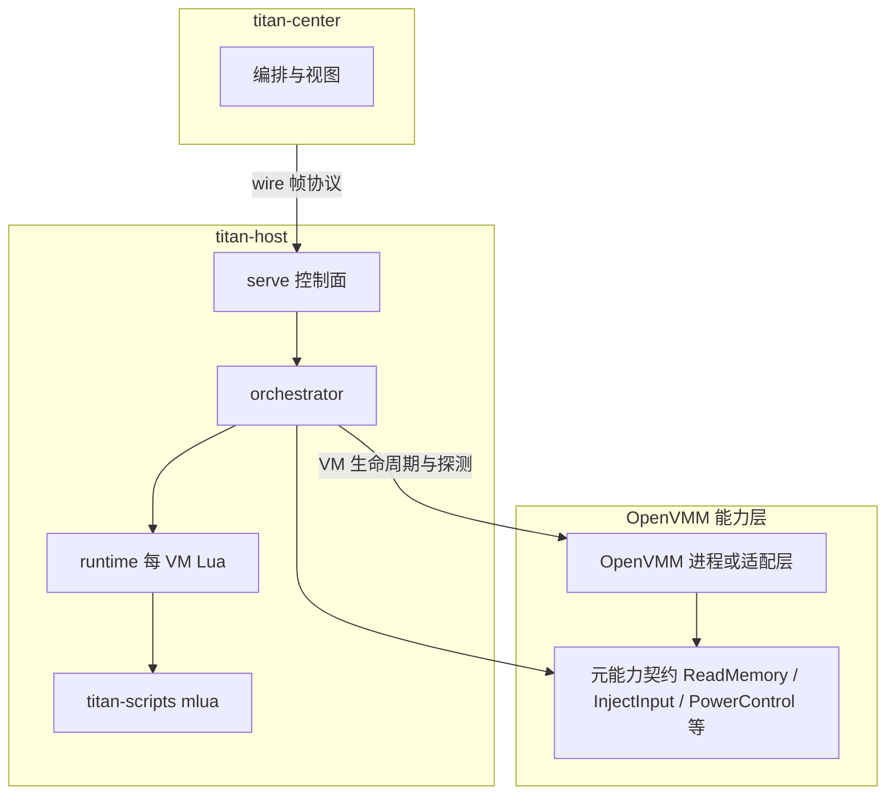

# titan-host Windows 架构

## 范围与权威来源

本文描述 **Windows 宿主 + OpenVMM 能力** 下的分层、控制面与能力探测；**不**改变 Phase 1 验收范围（以 **`need.md` 与当前 PR** 为准）。

- **Phase 1 DoD、主题 → crate 对照**：以 [`need.md`](../need.md) 与 [requirements-traceability.md](requirements-traceability.md) 为准（已无独立 `need_mapping` 源文件）。
- **元能力 → 实现轨 → 测试**：以 [requirements-traceability.md](requirements-traceability.md) 追溯表为准。
- **合法用途与免责声明**：见 [`need.md`](../need.md) 文首段落。
- **OpenVMM 权威说明与构建指引**：[The OpenVMM Guide](https://aka.ms/openvmmguide)（上游仓库：[openvmm](https://github.com/microsoft/openvmm)）。

**产品边界**：`titan-host` 的 VM **真源与 hypervisor 能力**以 **OpenVMM** 为工程基线（进程边界 + 窄协议推荐，避免在 Titan 内重复实现完整 VMM）。`titan-center` 可在其他桌面 OS 上运行以连接 Windows 宿主。

---

## 分层架构

中控、宿主服务与 OpenVMM 的关系如下（Lua 仅通过宿主 Rust 层调用能力）。

要点：

- **`titan-host`**：TCP 控制面、provision / 电源编排、每 VM **有界** Lua（`titan-host::runtime`）；对 VM 的创建 / 列表 / 电源等 **委托 OpenVMM**（或侧车进程），本仓库保留 **适配层 + `Capabilities` 诚实位**。
- **`titan-scripts`**：`mlua`（`lua54`、vendored），脚本语义由宿主暴露的 API 与 **`Capabilities`** 共同约束。
- **OpenVMM**：跨平台 VMM 实现来源；Windows 上可组合 WHP / MSHV 等后端（以上游 feature 矩阵为准）。**单一 owner**：同一 VM 实例不得被 Titan 适配层与另一套管理 API 同时驱动。

**与旧自研宿主 VMM 适配路径的关系**：该栈 **不再**作为产品目标；文档与 `need.md` 以 OpenVMM 为虚拟化能力基线。

---

## 元能力与诚实边界

[`need.md`](../need.md) 中五大元能力（内存、伪装、输入、视觉、网络）在 Windows 轨的落点随 OpenVMM 与宿主驱动集成阶段变化。

1. **协作式 Guest Agent**（TCP/JSON）为 Phase 1 与部分 Phase 2A 的闭环路径之一。
2. **Hypervisor 直连**（guest 物理内存、总线级输入、CPUID/MSR 级策略）由 OpenVMM / 驱动组合提供；**未接线**时须通过错误与 **`Capabilities`** 位诚实反映。
3. **内存语义**：区分 **guest 物理地址**（hypervisor 视角）与 **经 agent 的虚拟地址 / 载荷语义**。用户态 **未必**能无协作地读任意 guest RAM，具体以后端为准。

能力探测入口：[`Capabilities::from_host_runtime_probes`](../crates/titan-common/src/capabilities.rs) 与 [`host_runtime_probes`](../apps/titan-host/src/host_runtime_probes.rs)（`titan-host serve` 启动时）。

---

## 反检测 / 去虚拟化（概念层）

**统一思想**：在可控处拦截或改写对「虚拟化痕迹」敏感的观测——例如敏感指令（CPUID、RDTSC、MSR 等）的 VM-exit 处理、设备与固件呈现（PCI ID、ACPI/SMBIOS）、时间源一致性等。

**Windows**：**`VmSpoofProfile` / 离线 Hive** 等与磁盘镜像、宿主自动化衔接；与 **方案 B**（宿主 SB、驱动、来宾 vTPM）的边界见 [openvmm-secure-boot-matrix.md](openvmm-secure-boot-matrix.md)。

本文**不**给出针对第三方反作弊或具体商业软件的绕过步骤；工程上聚焦 **自有测试环境** 与文档化的能力边界。

---

## Lua 自动化约束

- 引擎：**`titan-scripts`**（`mlua`），由 **`titan-host::runtime`** 调度：有界队列、**每 VM 串行**、墙钟超时（见 `apps/titan-host/src/runtime.rs`）。
- 脚本 **不得** 假设存在 guest 物理内存直连；同一 Lua 入口的语义必须由 **OpenVMM 后端实现 + Capabilities** 定义，未实现时返回 **明确错误**。

---

## 代码里程碑（与文档基线）

- **控制面**：`titan-host::serve`、`titan-common::wire`；具体 VM 列表 / 电源等语义以 **OpenVMM 集成 PR** 为准（当前未接线时见 `dispatch` 等降级行为）。
- **非 Windows** 上宿主相关控制面保持 stub 或 **501**，与 **`need.md` / PR Phase 约定** 一致。

---

## 相关文档

| 文档 | 用途 |
|------|------|
| [need.md](../need.md) | 产品愿景、五大元能力、宿主后端说明 |
| [requirements-traceability.md](requirements-traceability.md) | 元能力 → OpenVMM 轨 → 代码锚点 |
| [openvmm-secure-boot-matrix.md](openvmm-secure-boot-matrix.md) | 宿主 / 来宾 SB 与驱动矩阵（OpenVMM 上下文） |
