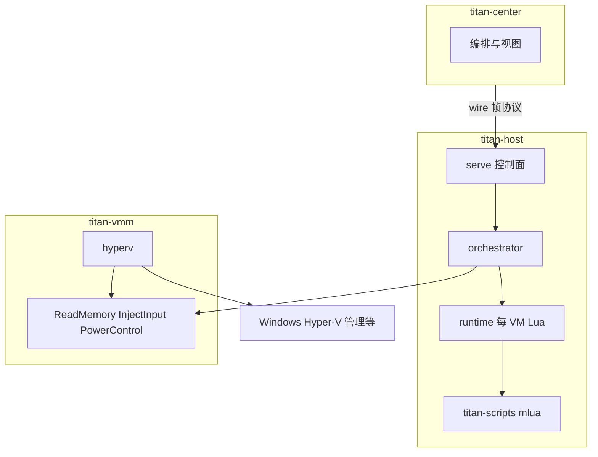

# titan-host Windows 架构

## 范围与权威来源

本文描述 **Windows 宿主 + Hyper-V** 下的分层、控制面与能力探测；**不**改变 Phase 1 验收范围。

- **Phase 1 DoD、主题 → crate 对照**：以 [`crates/titan-common/src/need_mapping.rs`](../crates/titan-common/src/need_mapping.rs) 为准。
- **元能力 → 实现轨 → 测试**：以 [requirements-traceability.md](requirements-traceability.md) 追溯表为准。
- **合法用途与免责声明**：见 [`need.md`](../need.md) 文首段落。

**产品边界**：`titan-host` 与 `titan-vmm` 的生产路径仅支持 **Windows + Hyper-V**。`titan-center` 可在其他桌面 OS 上运行以连接 Windows 宿主。

---

## 分层架构

中控、宿主服务、VMM 与 OS API 的关系如下（Lua 仅通过宿主 Rust 层调用能力）。

要点：

- **`titan-host`**：TCP 控制面、provision/电源编排、每 VM **有界** Lua（`titan-host::runtime`）；依赖 **`titan-vmm::hyperv`** 与能力探测。
- **`titan-scripts`**：`mlua`（`lua54`、vendored），脚本语义由宿主暴露的 API 与 **`Capabilities`** 共同约束。
- **`titan-vmm`**：共享 [`traits.rs`](../crates/titan-vmm/src/traits.rs) 中的 `ReadMemory`、`InjectInput`、`PowerControl`；[`hyperv`](../crates/titan-vmm/src/hyperv/mod.rs) 为唯一生产后端。[`platform_vm`](../crates/titan-vmm/src/platform_vm.rs) 在 Windows 上将 ListVms / 域电源路由到 `hyperv`。

**WHP 与 Hyper-V 管理轨**：仓库以 **Hyper-V 作为 VM 真源**（创建、存储、电源）。若未来引入 WHP 做 guest 物理内存读写或 exit 处理，须在架构上明确 **单一 owner**，避免两套 API 同时驱动同一实例。

---

## 元能力与诚实边界

[`need.md`](../need.md) 中五大元能力（内存、伪装、输入、视觉、网络）对 Windows 轨已写主要底层落点。

1. **协作式 Guest Agent**（TCP/JSON）为 Phase 1 与部分 Phase 2A 的闭环路径之一。
2. **Hypervisor 直连**（guest 物理内存、总线级输入、CPUID/MSR 级策略）按阶段实现；**未实现**时须通过错误与 **`Capabilities`** 位诚实反映。
3. **内存语义**：区分 **guest 物理地址**（hypervisor/WinHv 等视角）与 **经 agent 的虚拟地址 / 载荷语义**。`ReadMemory` 的文档注释已说明：在 Windows / Hyper-V 下，ring-3 **未必**能无协作地读任意 guest RAM。

能力探测入口：[`Capabilities::from_host_runtime_probes`](../crates/titan-common/src/capabilities.rs) 与 [`host_runtime_probes`](../apps/titan-host/src/host_runtime_probes.rs)（`titan-host serve` 启动时）。

---

## 反检测 / 去虚拟化（概念层）

**统一思想**：在可控处拦截或改写对「虚拟化痕迹」敏感的观测——例如敏感指令（CPUID、RDTSC、MSR 等）的 VM-exit 处理、设备与固件呈现（PCI ID、ACPI/SMBIOS）、时间源一致性等。

**Windows**：**`VmSpoofProfile` / 离线 Hive** 等与 Hyper-V 存储、宿主自动化衔接；与 **方案 B**（宿主 SB、驱动、来宾 vTPM）的边界见 [hyperv-secure-boot-matrix.md](hyperv-secure-boot-matrix.md)。

本文**不**给出针对第三方反作弊或具体商业软件的绕过步骤；工程上聚焦 **自有测试环境** 与文档化的能力边界。

---

## Lua 自动化约束

- 引擎：**`titan-scripts`**（`mlua`），由 **`titan-host::runtime`** 调度：有界队列、**每 VM 串行**、墙钟超时（见 `apps/titan-host/src/runtime.rs`）。
- 脚本 **不得** 假设存在 guest 物理内存直连；同一 Lua 入口的语义必须由 **后端实现 + Capabilities** 定义，未实现时返回 **明确错误**。

---

## 代码里程碑（已实现）

- **`titan-vmm::platform_vm`**：在 **Windows** 上 `ListVms` 与单 VM 电源走 `hyperv`；非 Windows 构建下返回空列表 / `NotImplemented`（供中控等 crate 交叉编译，非生产宿主路径）。
- **非 Windows** 上 `ApplySpoofProfile` 控制面返回 **501**（不再调用 `mother_image` 后再报 500）。

---

## 相关文档

| 文档 | 用途 |
|------|------|
| [need.md](../need.md) | 产品愿景、五大元能力、宿主后端说明 |
| [requirements-traceability.md](requirements-traceability.md) | 元能力 → Windows 轨 → 代码锚点 |
| [hyperv-secure-boot-matrix.md](hyperv-secure-boot-matrix.md) | 仅 Windows / Hyper-V 的 SB / 驱动矩阵 |
