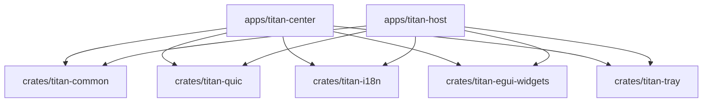

# Titan-v 项目结构文档

## 1. 仓库总览

Titan-v 采用 Rust workspace 组织，顶层按“应用层 + 公共库 + 文档/资源/工具”分区：

- `apps/`：可执行应用（`titan-center`、`titan-host`）
- `crates/`：共享库与基础组件
- `docs/`：需求、架构、接口、追溯等文档
- `assets/`：平台资源（图标、manifest 等）
- `tools/`：工程脚本（如函数行数检查）

## 2. workspace 成员

定义在根 `Cargo.toml`：

- `apps/titan-center`
- `apps/titan-host`
- `crates/titan-common`
- `crates/titan-quic`
- `crates/titan-i18n`
- `crates/titan-egui-widgets`
- `crates/titan-tray`

## 3. 应用层目录

### 3.1 `apps/titan-center`

中控桌面应用，核心职责：

- 设备发现与接入管理（LAN/手动添加）
- QUIC 控制请求发起与响应处理
- 遥测展示、设备卡片、批量操作编排
- 中控本地持久化（配置/设备状态）

关键子路径（示意）：

- `src/app/discovery.rs`：发现广播与网卡绑定列表逻辑
- `src/app/net/`：网络会话、RPC/telemetry 处理
- `src/app/ui/`：egui 面板与交互
- `src/app/center_shell/`：应用状态编排与生命周期

### 3.2 `apps/titan-host`

宿主节点应用，核心职责：

- 启动 QUIC+mTLS 控制面服务
- 响应中控控制请求（dispatch）
- 输出遥测与桌面预览
- LAN 公告与注册回应

关键子路径（示意）：

- `src/serve/run.rs`：服务入口与生命周期
- `src/serve/dispatch.rs`：控制请求分发与执行
- `src/serve/announce.rs`：LAN 公告与网卡绑定策略
- `src/host_app/`：宿主本地 UI 与状态

## 4. 公共库目录

### 4.1 `crates/titan-common`

跨应用共享契约层：

- 线协议模型：`wire/`
- 发现 beacon：`discovery.rs`
- 能力模型：`capabilities.rs`
- 错误与状态类型：`error.rs`、`state.rs`
- 跨平台网卡筛选：`net_iface.rs`

它是 Center/Host 共享的“协议与数据真源”。

### 4.2 `crates/titan-quic`

QUIC 与 mTLS 封装层，负责：

- 端点与连接建立
- 证书/指纹信任相关能力
- framed IO 与会话辅助

### 4.3 `crates/titan-i18n`

多语言文本资源与映射（中英文文案）。

### 4.4 `crates/titan-egui-widgets`

共享 egui 组件样式与通用控件封装。

### 4.5 `crates/titan-tray`

系统托盘与相关平台交互封装。

## 5. 文档与资源

- `docs/requirements-traceability.md`：需求到实现追溯
- `docs/project-interfaces.md`：接口契约
- `docs/technical-architecture.md`：技术架构
- `docs/project-structure.md`：本文件（结构视图）
- `assets/windows/`：Windows 打包/manifest 相关资源

## 6. 依赖关系（高层）

## 7. 结构演进建议

- 共享逻辑优先下沉 `titan-common`，避免 Center/Host 双端重复维护。
- 协议、能力位、发现模型改动要保持同仓同步，避免“文档与实现漂移”。
- 新增模块优先遵循“单一职责 + 小文件 + 可测试”原则。
