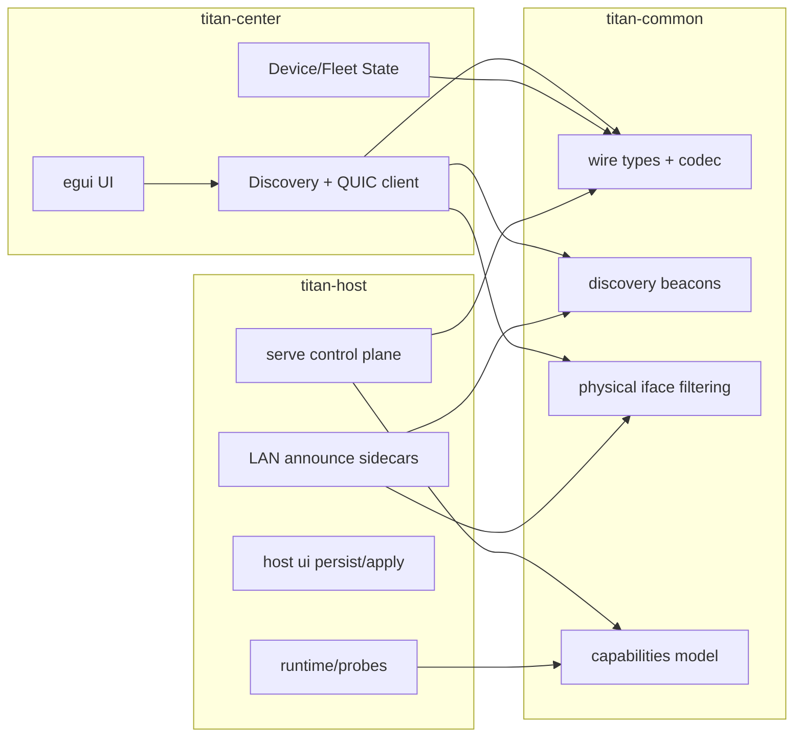

# Titan-v 技术架构文档

## 1. 架构目标

Titan-v 采用“中控编排 + 宿主执行 + 公共契约”三层架构，目标是：

- 控制面协议稳定（Center/Host 解耦演进）
- 能力边界诚实（由 `Capabilities` 与运行探测驱动）
- 平台差异收敛（跨平台通用逻辑沉到 `titan-common`）

## 2. 分层与职责

## 3. 关键模块映射

- **协议与数据模型**
  - `crates/titan-common/src/wire/*`
  - `crates/titan-common/src/discovery.rs`
  - `crates/titan-common/src/capabilities.rs`
- **跨平台网卡策略（统一）**
  - `crates/titan-common/src/net_iface.rs`
- **Center 侧**
  - `apps/titan-center/src/app/discovery.rs`
  - `apps/titan-center/src/app/net/*`
  - `apps/titan-center/src/app/center_shell/*`
- **Host 侧**
  - `apps/titan-host/src/serve/run.rs`
  - `apps/titan-host/src/serve/announce.rs`
  - `apps/titan-host/src/serve/dispatch.rs`

## 4. 端到端通信路径

### 4.1 LAN 发现与注册

1. Center 广播 `CenterPollBeacon`。
2. Host 监听轮询并回发 `HostAnnounceBeacon`（含 `host_quic_addr` 与指纹）。
3. Center 合并设备列表并更新 UI/状态。

### 4.2 控制请求响应

1. Center 通过 QUIC bi-stream 发送 `ControlRequestFrame`。
2. Host `dispatch` 执行并返回 `ControlResponse`。
3. Center 以 `id` 关联请求与响应，驱动 UI 反馈。

### 4.3 遥测推送

1. Center 发起 `SubscribeTelemetry`。
2. Host 应答后开启 uni-stream，持续发送 `ControlPush`。
3. Center 按 host/session 路由更新资源、预览、在线状态。

## 5. 跨平台策略

- **Center** 可在多桌面平台运行；**Host** 以 Windows 路径为主（OpenVMM 接线方向）。
- 平台相关逻辑尽量集中在：
  - `titan-common` 的可复用模块（如网卡筛选）
  - `cfg(target_os = ...)` 的局部实现
- 业务层调用统一接口，避免在 `center/host` 双端重复维护。

## 6. 架构约束与演进原则

- **单一职责**：UI、协议、运行时探测、平台适配分层明确。
- **契约先行**：`titan-common` 的模型与版本是 Center/Host 共享契约。
- **向后演进**：协议新增字段/变体优先追加，破坏性变更同步 `PROTOCOL_VERSION`。
- **可观测性**：关键路径有结构化日志与可追踪状态更新。

## 7. 相关文档

- [project-interfaces.md](project-interfaces.md)
- [fleet-control-plane.md](fleet-control-plane.md)
- [quic-mtls-transport-design.md](quic-mtls-transport-design.md)
- [host-windows-architecture.md](host-windows-architecture.md)
- [requirements-traceability.md](requirements-traceability.md)
